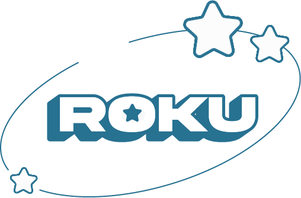

# Flashback back through time

## Relive the Movies, TV Shows, and Music of your childhoods by yourself or with your kids. We bring you the best curated selection  from the 50s, through the 90s

### Wanna watch some more "scandelous" content like _Three's company_, _Pulp Fiction_, or the Christmas classic _Die Hard_? Select your profile and enjoy

### But now the kids Wanna watch with you? Switch to the kids profile and enjoy kid friendly content like _Scooby Doo Where Are you?_, _The Jetsons_ and _The Partridge Family_

### Not in the mood for a Movie or TV show, but wanna rock out or dance to music? Well we got that covered. We'vs got that 80s glam rock to bang you head to, or the smooth sounds of the 50s. Anything to set the right mood

#### Created by Izzu Antonucci and Kenneth Rose

## Required Components:

- [Site Frontend](https://github.com/kgrose102/antonucci_rose_rokufront)
- [Site Backend](https://github.com/kgrose102/antonucci_rose_rokuback)
- [Api backend and Databases](https://github.com/kgrose102/antonucci_rose_api)
- [Content Files](https://1drv.ms/u/s!ArZVsiqfft1BrtpvEfUB0xsDPu1hMQ?e=5BmBhY)
    - download the files and add each folder: video, audio, and shows into the assets directory.

## To Run:
- cd into antonucci_rose_api
- update database name in .env file with the one in your MySQL
- and update .env file with your mySQL Login information and Port
- run 'php -S localhost:{port you are using} -t public'
- make sure you have php as a command line path
- in Vue update vue.config.js the following:
    - const API_URL = "http://localhost:{port you are using}/Roku_flashback"
    - const APIAUD_URL = "http://localhost:{port you are using}/audio"
    - const APISHO_URL = "http://localhost:{port you are using}/shows"

#### For Non Lumen API:

- Add file to your htdocs (MAMP), or www (Wamp) folder.
- Make sure it's an active path.
- then add the path into the Vue.config file of the Front end
- use the following in vue.config.js
    - const API_URL = "http://roku-flashback/api/index.php"
    - const APIAUD_URL = "http://roku-flashback/api/indexAudio.php"
    - const APISHO_URL = "http://roku-flashback/api/indexShow.php"

### This a dynamic Web Application that seamlessly works on Roku systems, web, and mobile

Built using Vue.CLI, express, and a PHP API.

[Development roadmap and Design documents](https://drive.google.com/drive/folders/1YcSSL_2XcVb5oM67r4d4Ph736_vRER_-?usp=sharing)

Movies, TV Shows, and music are the property and copyright of their respective owners and are liscened to be used on this site following the terms of our contracts with the license holders.

All rights reserved 2022©
ReadMe vr. 2.0
Application vr. public 1.0
# roku_public
